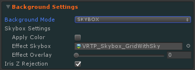
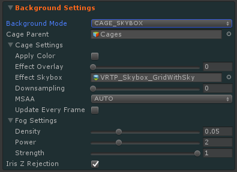
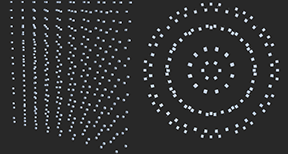
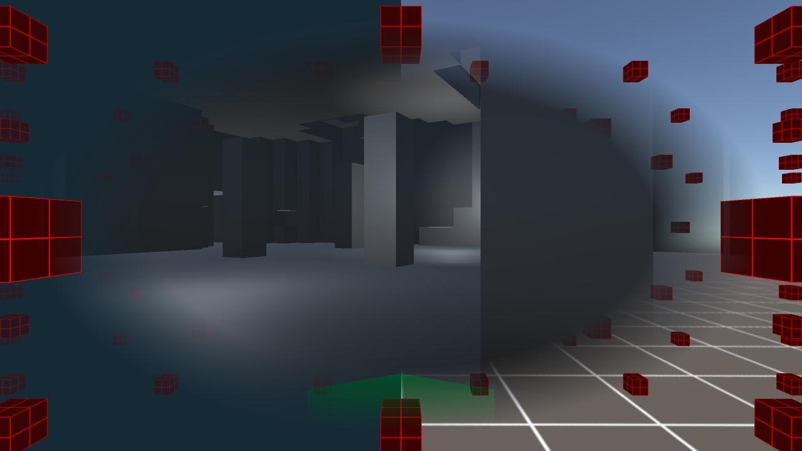
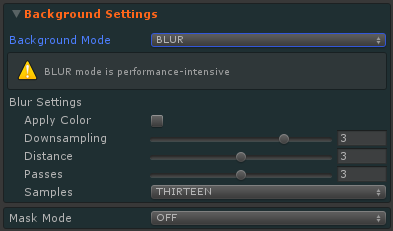
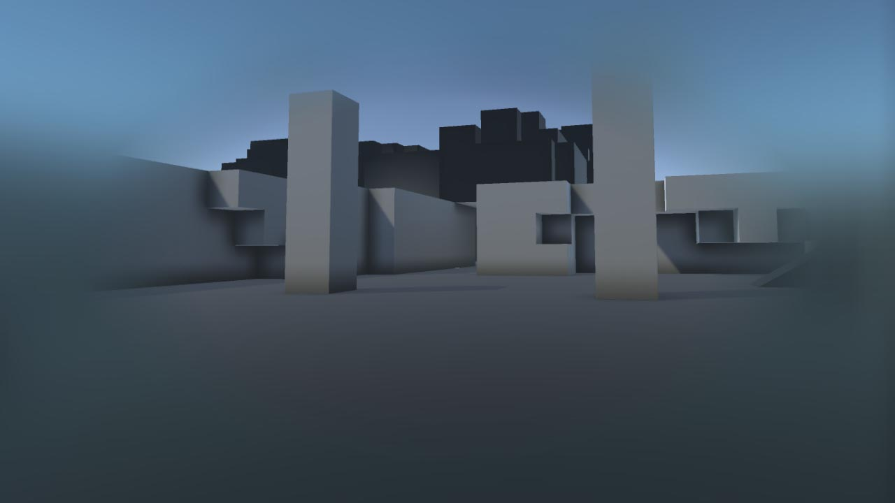

\page bkg Background Modes
The **Background Mode** dropdown selects between the major effect types. 

The default - **COLOR** - is a simple colored vignette. This has no other controls outside \ref effect "Effect Settings".

> **TIP:** All \ref mask "Mask Modes" can be used with all **Background Modes** - for example, \ref mmask "MASK" with \ref mblur "BLUR" will blur everything in the periphery except masked objects.

Various modes allow the **Iris Z Rejection** setting, an optimization that saves pixel fillrate and overdraw. Before the scene is drawn, this writes to the z-buffer where the vignette is opaque. This stops pixels being written only to be obscured by the effect.

> **TIP:** This is disabled with masking or blur, as well as when **Effect Color** alpha is less than 1, as the effect has to use pixels from the rendered scene within the periphery.

## Background Modes
- \subpage mskybox
- \subpage mcage
- \subpage mblur

> **TIP:** The mobile version cannot use **CAGE** or **BLUR** modes. Please see the \ref mobile "mobile manual page" for details.

    
    Left: **COLOR** mode. Right: **SKYBOX** mode.

\page mskybox SKYBOX Mode
This mode replaces the colored vignette with a cubemap-base skybox cage anchored to the **Motion Transform**. This is a performant way to give the user a static reference frame instead of just fade out the "real" world.

> **TIP:** VRTP includes starter cage cubemaps in *VrTunnellingPro/Prefabs/Skyboxes*. By default these import at low res. For full quality, switch to 4096.

## Settings

    
    SKYBOX mode settings

- **Apply Color**: If ticked, cubemap will be tinted by **Effect Color**.
- **Effect Skybox**: The texture to use (must be a cubemap).
- **Iris Z Rejection**: Supported by this mode as long as **Mask Mode** is **OFF**. See \ref bkg "Background Modes" for details.

    
    **SKYBOX** mode. A cubemap skybox is drawn in the vignette.

\page mcage CAGE_COLOR & CAGE_SKYBOX Modes
This mode replaces the colored vignette with a fully 3D cage anchored to the **Motion Transform**. This is a highly flexible way to give the user a static reference frame instead of just fade out the "real" world.

\ref mskybox "SKYBOX Mode" will often be slightly faster, but the **CAGE** modes allow easy editing, depth perception and moving objects as desired. **CAGE_COLOR** draws 3D objects on a plain color background, while **CAGE_SKYBOX** uses a cubemap background.

> **TIP:** VRTP includes starter cage cubemaps in *VrTunnellingPro/Prefabs/Skyboxes*. By default these import at low res. For full quality, switch to 4096.

To use these modes, set **Background Mode** to either, and create an empty gameobject parented to the **Motion Transform** object. Drag this gameobject into the **Cage Parent** field. Now, any children of this object will be drawn in the vignette.

**Note that you *MUST* use unlit shaders for these objects - no lighting is rendered for cage objects.**

## Shaders
VRTP includes four unlit shaders for use on cage objects, in the material shader menu under *VrTunnellingPro/Cage*.
- **Opaque**: Opaque textured shader with color and brightness.
- **Transparent**: As **Opaque** but alpha blended.
- **Opaque Fogged**: As **Opaque** but with fog.
- **Transparent Fogged**: As **Transparent** but with fog.

The **Fogged** shaders use settings from the *Tunnelling* effect in the **Fog Settings** section (see below). They do not use Unity's fog, so you can use different settings in the world and in the cage.

> **TIP:** To write custom shaders affected by the cage fog, use *VrTunnellingPro/Shaders/CageFog.cginc*. Follow the VRTP cage shaders for implementation.

## Settings

    
    **CAGE_SKYBOX** mode settings. **CAGE_COLOR** mode is identical but 
    without the **Effect Skybox** field.

- **Cage Parent**: Parent of cage objects. 
  - Automatically disabled - not drawn in normal rendering.
- **Cage Settings**:
  - **Apply Color**: If ticked, entire vignette will be tinted by **Effect Color**.
    - Fog color is always **Effect Color**.
    - In **CAGE_COLOR** mode, background color is always **Effect Color**.
  - **Effect Skybox** (**CAGE_SKYBOX** only): The background skybox to use (must be a cubemap).
  - **Downsampling**: Render the cage at full (0) half (1) or quarter (2) resolution.
  - **MSAA**: Antialiasing setting for cage rendering.
    - **AUTO**: Use quality settings for cage MSAA.
    - **OFF**: Force no MSAA for cage rendering.
    - **X2,X4,X8**: Force 2, 4 or 8x MSAA for cage rendering.
  - **Update Every Frame**: If true, check for added/destroyed cage objects every frame.
    - This will create a small amount of garbage every frame.
    - **You can move, modify, enable or disable existing cage objects without this!**
    - Consider using \ref Sigtrap.VrTunnellingPro.TunnellingImageBase.UpdateCage "UpdateCage()" manually when adding/removing cage objects to avoid unnecessary GC allocation.
- **Fog Settings**: These settings only affect in-built cage fogged shaders or custom ones using CageFog.cginc. **Effect Color** sets the fog color.
  - **Density**: Overall density of fog. Affects how quickly fog builds up over distance.
  - **Power**: Fog falloff. Higher values will build up more abruptly.
  - **Strength**: Blending. At 0, fog has no effect. At 1, fog has full effect.
- **Iris Z Rejection**: Supported by this mode as long as **Mask Mode** is **OFF**. See \ref bkg "Background Modes" for details.

> **TIP:** You can move, modify, enable or disable existing cage objects without turning on **Update Every Frame**!

## Prefabs

  
  The included **ComfortCubes** and **ComfortCubesPolar** cage prefabs

VRTP includes some example cage prefabs in *VrTunnellingPro/Prefabs/Cages*. **ComfortCubes** and **ComfortCubesPolar** are grids of cubes in two arrangements to give users a strong static reference. **VehicleCage** is a simple, long grid useful for cockpit-based games where most motion is in the direction of the vehicle.

    
    Left: **CAGE_COLOR** mode. Right: **CAGE_SKYBOX** mode. Both use the ComfortCubes cage prefab.

\page mblur BLUR Mode
This mode blurs the periphery instead of fading or replacing it. This provides less of a grounding effect, but can be perfect for players who suffer lower-than-average sim-sickness and find the other modes distracting.

> **TIP:** This mode is significantly more performance-intensive than other modes! See **Optimisation** below.

## Settings

    
    BLUR mode settings

- **Apply Color**: If ticked, blur will be tinted by **Effect Color**.
- **Downsampling**: Use lower resolutions for the blur effect.
  - This increases both blurriness and performance, but lowers overall quality.
- **Distance**: How much to blur the image by.
  - This has no impact on performance, but high values can make the blur less smooth.
- **Passes**: How many times to repeat the blur.
  - High values increase the blur but can significantly impact performance.
- **Samples**: Higher values give a smoother blur quality but can impact performance.

## Optimisation
For a big blur that's cheaper on GPU time (but lower quality), maximise **Downsampling** and **Distance**, set **Samples** to **FIVE** and keep **Passes** as low as possible.

For most projects, this will be the fastest option. However some CPU-bound projects *may* get faster results by keeping **Downsampling** and **Passes** low, although maximum blur will be more limited.

Remember that the point of tunnelling is to affect what the user is *not* looking at - as such, lower quality blur is *generally* not a problem. Low frame rate always is!

    
    **BLUR** mode.

