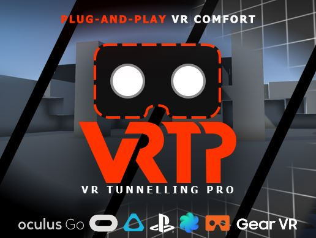

# VR Tunnelling Pro

  
  VRTP is a drop-in VR tunnelling solution for Unity 5.6+. Check out the \ref quickstart "Quickstart Guide" or watch the tutorial video to dive right in!

  

    \htmlonly
    <iframe width="400" height="225" src="https://www.youtube.com/embed/9fgkpM6211w?showinfo=0" frameborder="0" gesture="media" allow="encrypted-media" allowfullscreen></iframe>
    \endhtmlonly
    
Trailer

  

  

    \htmlonly
    <iframe width="400" height="225" src="https://www.youtube.com/embed/VW7a_TBVNjI?showinfo=0" frameborder="0" gesture="media" allow="encrypted-media" allowfullscreen></iframe>
    \endhtmlonly
    
Intro / Demo

  

  

    \htmlonly
    <iframe width="400" height="225" src="https://www.youtube.com/embed/hRLiKmhSIhE?showinfo=0" frameborder="0" gesture="media" allow="encrypted-media" allowfullscreen></iframe>
    \endhtmlonly
    
Tutorial

  

  
  VRTP is a drop-in VR tunnelling solution for Unity 5.6+. Check out the \ref quickstart "Quickstart Guide" or watch the tutorial video to dive right in!

## What is Tunnelling?
Tunnelling is a technique to reduce sim-sickness in VR games, experiences and apps.

Artificial locomotion in VR - cars, spaceships, first-person "thumbstick" movement - causes sim-sickness in many users. This is a result of a mismatch between the motion they feel and the motion they see. Tunnelling is a highly effective method to reduce this for a large number of users. 

It works by fading out peripheral vision. The subconscious uses peripheral vision heavily to interpret motion but the conscious brain largely ignores it - as such, reducing motion in the periphery combats the overall motion disparity users feel without significant information loss.

Additionally, the periphery can be replaced with static imagery to counteract motion even more strongly, "grounding" users in a static reference frame. This is called a "cage" as including a cage or grid maximises this effect.

## Key Features
- Multiple modes
  - Color vignette
  - Replace periphery with skybox/cubemap cage
  - Replace periphery with customised full 3D cage
  - View VR scene through static "windows"
  - View cage through world-space portals
- Masking
  - Exclude objects from the tunnelling effect
  - e.g. static cockpit to help ground users
- Fully configurable
  - Tweak any settings in-editor or at runtime for full control
- Preset system
  - Easily define multiple presets that users can switch between at runtime
- Full source code
  - Hook into code or make custom edits
- Supports Vive, Rift, PSVR, Go, Gear VR, Daydream and more
  - Mobile-friendly version included
- Compatible with Multipass and Single Pass Stereo (non-mobile only)
- High performance

    

